# Kairn en images

Toutes les captures de cette page viennent de l'application réelle (version 0.9.4) et de Kairn Desk. Les séances affichées sont **synthétiques** : des boucles calculées par `scripts/demo-sessions.mjs` autour d'un point fictif, jamais une vraie sortie. Les images sont libres de réutilisation, sous la même licence que le projet (MIT).

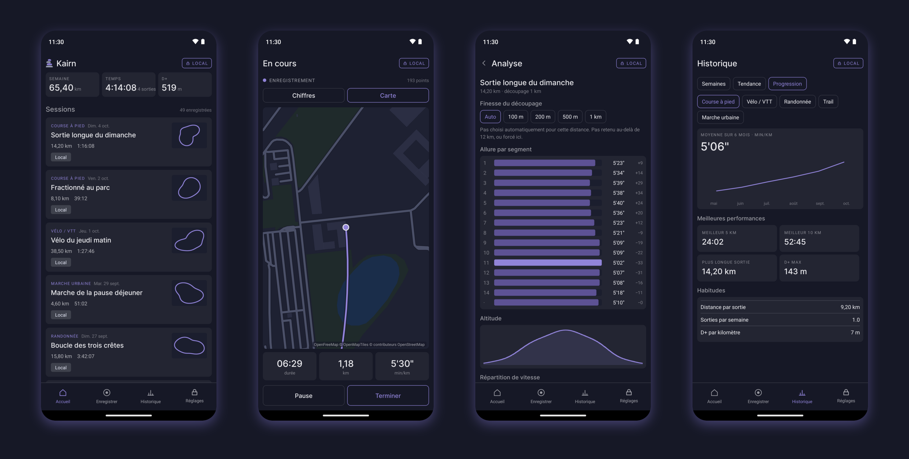

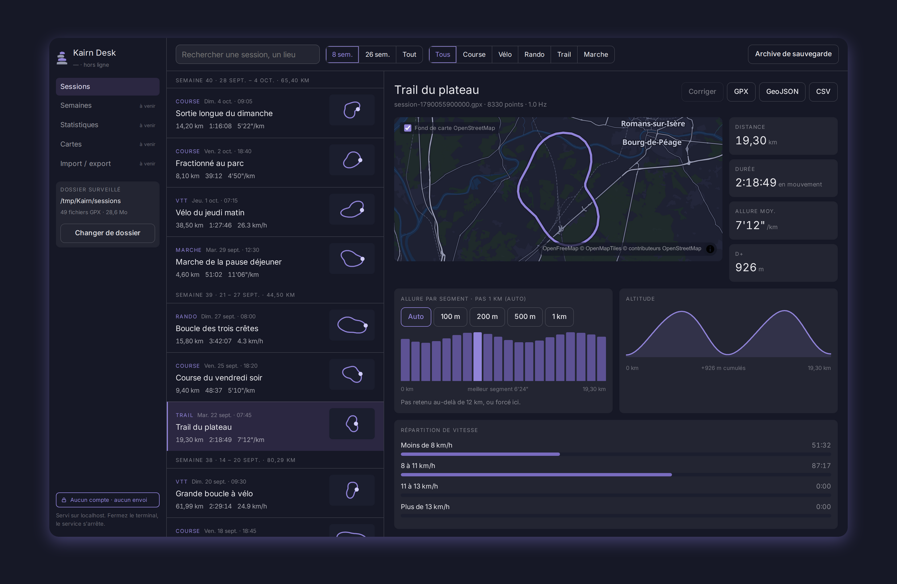

## L'application Android

### Premier lancement

Trois écrans expliquent ce que fait l'app, puis on choisit où ranger les séances : dans le téléphone (par défaut), ou aussi dans un dossier que l'on synchronise comme on veut.

| Vos données restent ici | Le GPS fonctionne hors ligne | Où ranger vos séances |
|:-:|:-:|:-:|
| 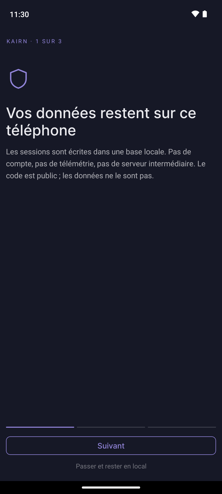 | 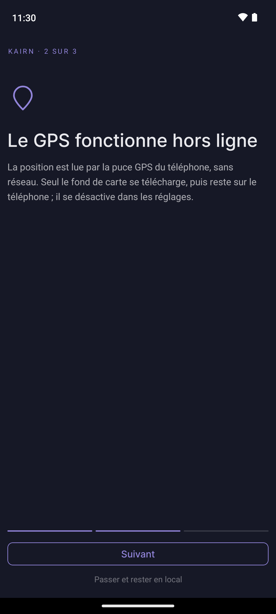 | 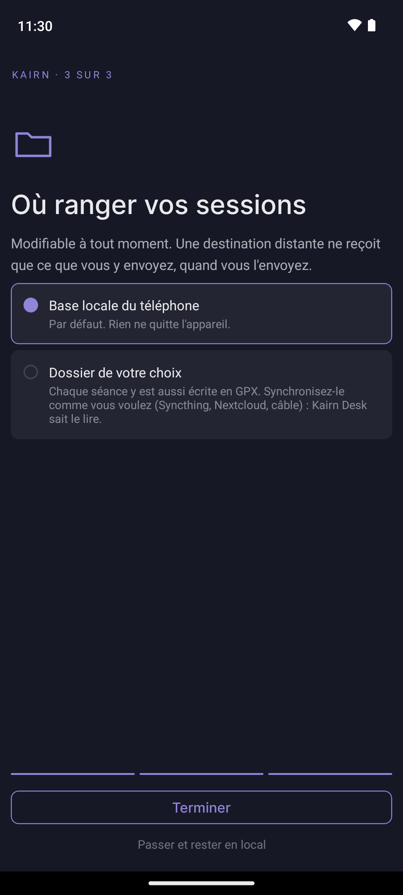 |

### Accueil et enregistrement

L'accueil résume la semaine (distance, temps, dénivelé) et liste les séances avec leur tracé. On choisit l'activité, on appuie sur Démarrer : l'enregistrement continue écran verrouillé, avec une vue chiffres et une vue carte.

| Accueil | Nouvelle séance | En cours : chiffres | En cours : carte |
|:-:|:-:|:-:|:-:|
| 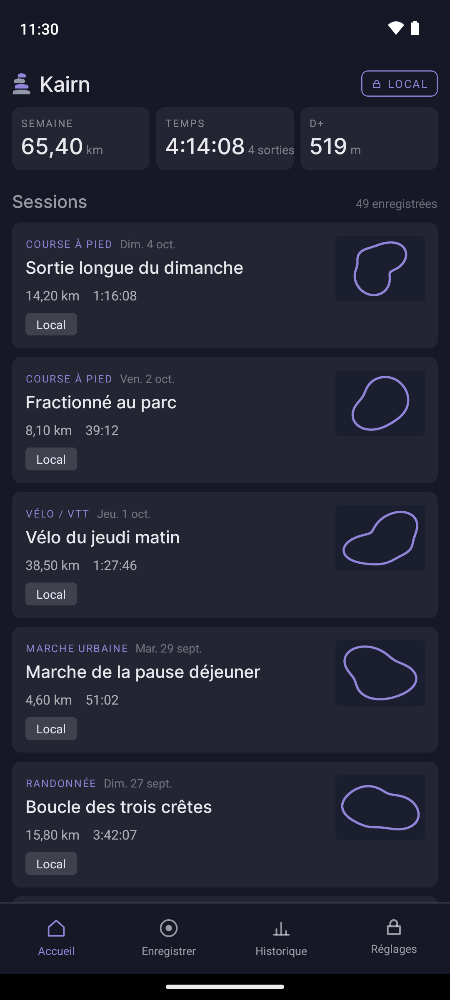 | 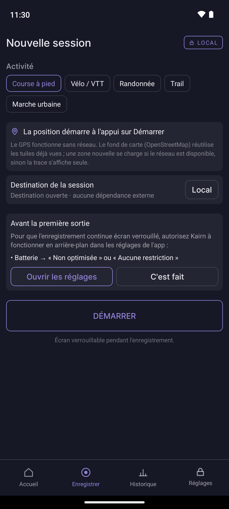 | 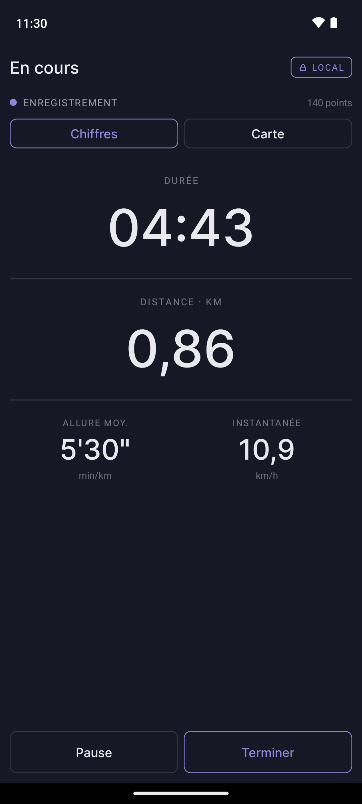 | 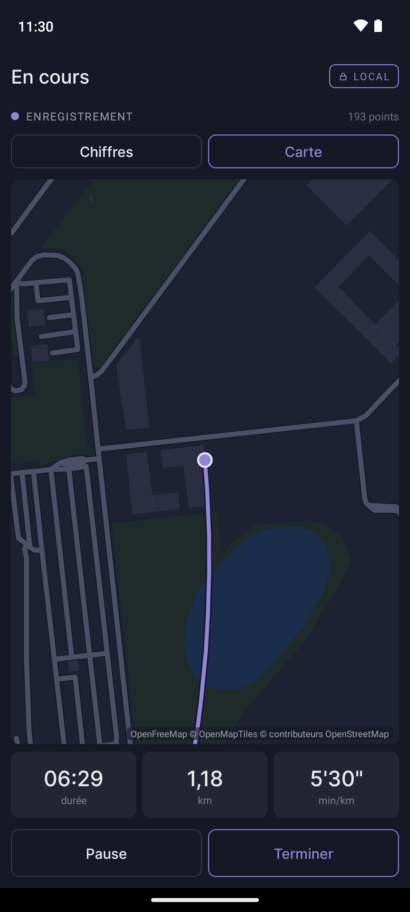 |

### Après la sortie

Le résumé donne la trace sur fond de carte et les chiffres clés. L'analyse découpe la séance en segments (pas automatique ou choisi), trace le profil d'altitude et la répartition du temps par zone de vitesse.

| Résumé de séance | Allure par segment | Altitude et vitesse |
|:-:|:-:|:-:|
| 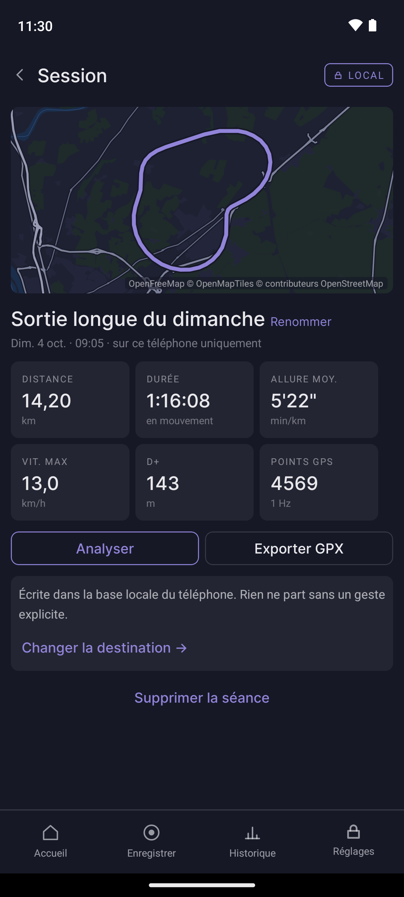 | 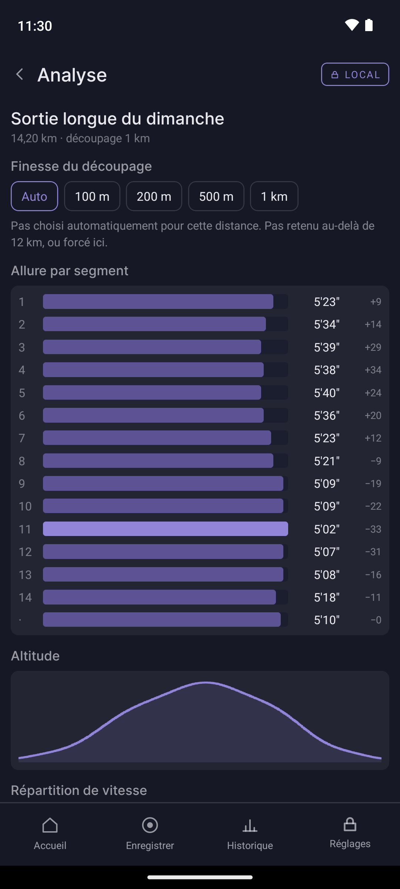 | 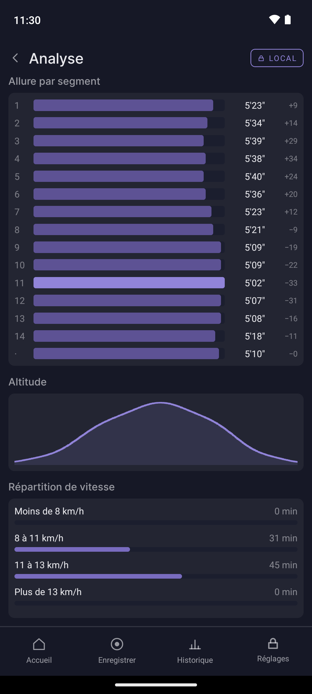 |

### Historique

Trois vues : les semaines (dépliables), la tendance du volume sur 4 semaines, 12 semaines ou un an, et la progression par sport avec les meilleures performances.

| Semaines | Tendance | Progression |
|:-:|:-:|:-:|
| 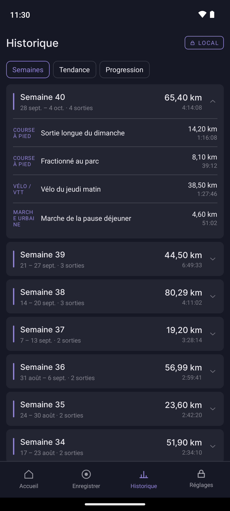 | 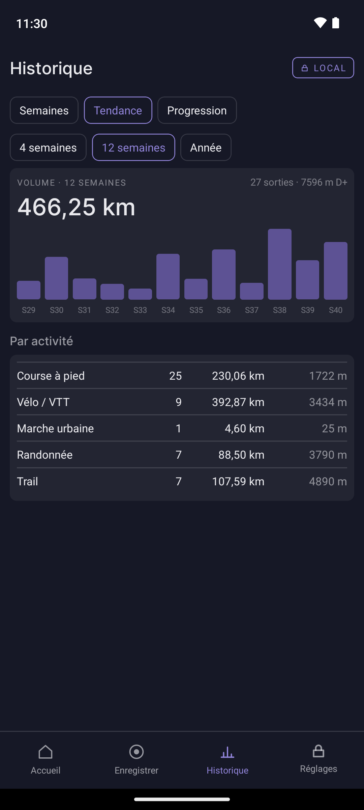 | 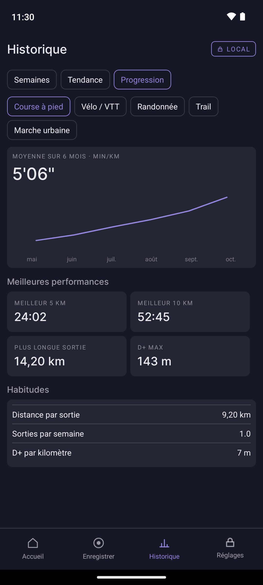 |

### Réglages et échanges

Les réglages disent combien de séances sont rangées et où, permettent de masquer départ et arrivée avant tout envoi, de couper le fond de carte. L'export écrit un GPX, GeoJSON ou CSV ; l'import relit un GPX venu d'ailleurs.

| Réglages | Export / import |
|:-:|:-:|
| 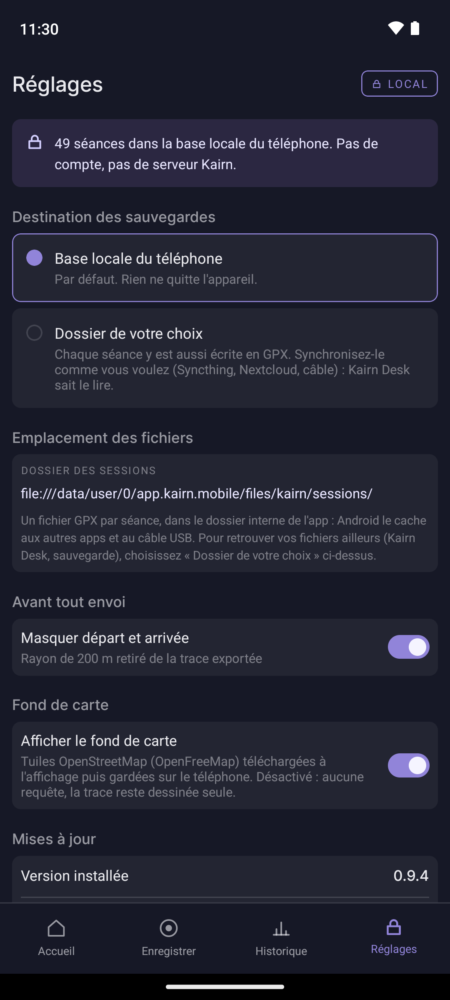 | 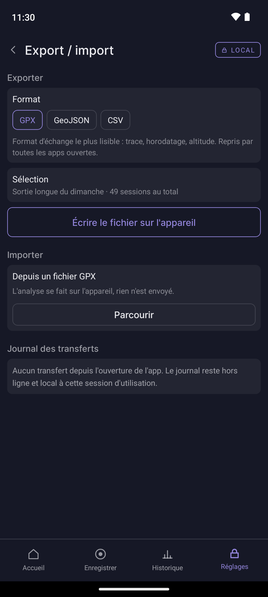 |

## Kairn Desk

Kairn Desk lit le dossier où le téléphone écrit ses séances et les affiche en grand dans le navigateur, sur `localhost` uniquement.

| Liste des séances | Détail d'un trail | Détail d'une sortie à vélo |
|:-:|:-:|:-:|
| 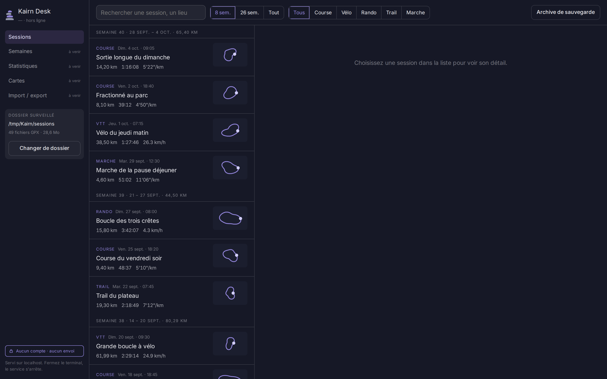 | 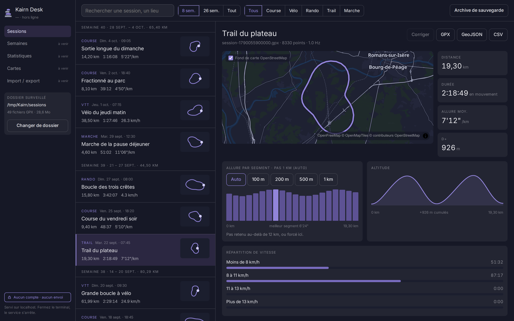 | 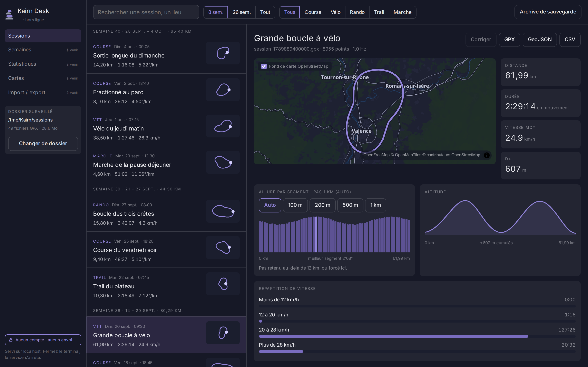 |

## Refaire les captures

Les captures sont refaites sur un émulateur, jamais sur un téléphone personnel : il contiendrait de vraies traces, et l'écran En cours montrerait la position réelle.

**Données.** Générer les séances de démonstration, datées par rapport au jour choisi :

```bash
npm run demo:sessions -- /tmp/Kairn/sessions --now=2026-10-04T11:30
```

**Kairn Desk.** `KAIRN_SESSIONS_DIR=/tmp/Kairn/sessions npm run desk:dev`, puis une fenêtre de 1440 × 900 (le dossier affiché dans le panneau de gauche est celui de la variable : choisir un chemin qui ne contient pas de nom d'utilisateur).

**Mobile.** Un émulateur sur une image AOSP (`system-images;android-34;default;x86_64`, profil Pixel 7), qui autorise `adb root` :

```bash
KAIRN_ABIS=x86_64 npm run mobile:apk            # APK pour l'émulateur
emulator -avd <avd> -timezone Europe/Paris -change-locale fr-FR &
adb install -r apps/mobile/android/app/build/outputs/apk/release/app-release.apk
```

Après l'onboarding, copier les séances dans le dossier de l'app, puis relancer l'app :

```bash
adb root
adb shell am force-stop app.kairn.mobile
adb push /tmp/Kairn/sessions/. /data/data/app.kairn.mobile/files/kairn/sessions/
adb shell 'u=$(stat -c %U /data/data/app.kairn.mobile); chown -R $u:$u /data/data/app.kairn.mobile/files/kairn; restorecon -R /data/data/app.kairn.mobile/files/kairn'
```

Barre d'état propre (heure fixe, batterie pleine, aucune notification) et navigation par gestes :

```bash
adb shell cmd overlay enable com.android.internal.systemui.navbar.gestural
adb shell settings put global sysui_demo_allowed 1
adb shell am broadcast -a com.android.systemui.demo -e command enter
adb shell am broadcast -a com.android.systemui.demo -e command clock -e hhmm 1130
adb shell am broadcast -a com.android.systemui.demo -e command battery -e level 100 -e plugged false
adb shell am broadcast -a com.android.systemui.demo -e command notifications -e visible false
```

Pour l'écran En cours, rejouer une des traces synthétiques comme position GPS, un point par seconde, pendant que l'enregistrement tourne : `adb emu geo fix <lon> <lat> <altitude>` pour chaque `<trkpt>` du fichier. Le module de position de Kairn lit le fournisseur GPS d'Android, que l'émulateur alimente ainsi.

Chaque capture : `adb exec-out screencap -p > capture.png`.
